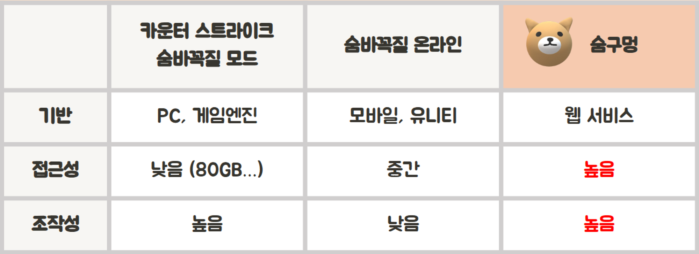
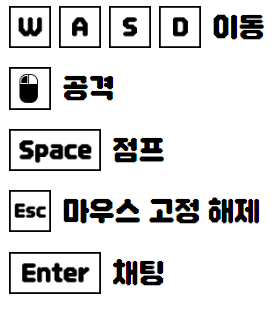
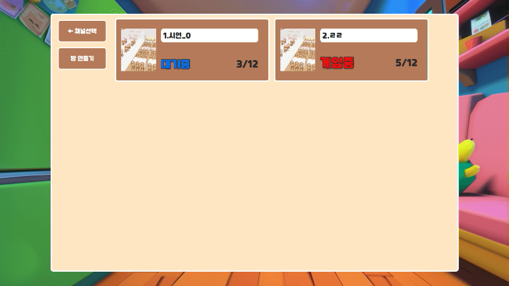
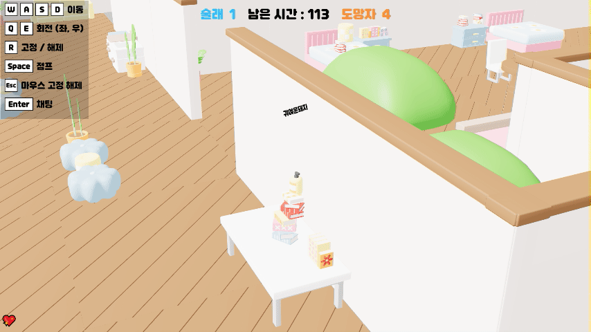
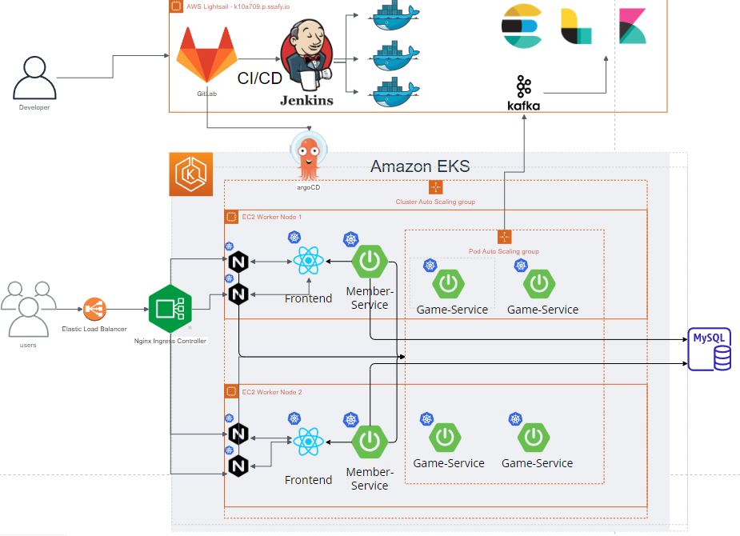

# 📜 목차

1. [서비스 소개](#서비스-소개)
2. [기획 배경](#기획-배경)
3. [개발 환경](#개발-환경)
4. [플레이 방법](#플레이-방법)
5. [화면소개](#-화면-소개)
6. [기술 스택](#-기술-스택)
7. [기술 특이점](#-기술-특이점)
8. [서비스 아키텍처](#-서비스-아키텍처)
9. [팀원 소개](#-팀원-소개)
---

# 🐜 서비스 소개 🐜
## 숨구멍 : 숨바꼭질 게임
## ✨서비스 설명 ✨

### ✨개요 ✨

- 실시간 웹소켓 숨바꼭질게임, **숨구멍**은 캐쥬얼하게 즐길 수 있는 게임입니다.
- 플레이어는 실시간으로 술래와 도망자로 나뉘어 숨바꼭질 게임을 즐길 수 있습니다.
- 술래는 제한 시간 내에 도망자를 찾아야하고, 도망자는 술래를 피해 물체로 변해 숨어야 합니다.


### 🎯 타겟 🎯

- 게임을 좋아하는 모든 사람들


[//]: # (## UCC 🎞️)


# ✨기획 배경 ✨

## 배경

- **실시간 웹소켓 게임**을 통해 사용자들이 즐길 수 있는 게임을 제공하고자 하였습니다.
- 기존 존재하는 게임에 비해 접근성이 좋고 가볍게 즐길 수 있는 게임을 제공하고자 하였습니다.
- 마우스와 키보드를 사용하여 쉽게 조작할 수 있는 게임을 제공하고자 하였습니다.


## 타 서비스와의 차별성과 특장점 🥅


- PC게임에 비해 설치할 필요가 없어 접근성이 좋습니다.
- 모바일 게임에 비해 더 큰 화면에서 더 좋은 조작감으로 게임을 즐길 수 있습니다.
---

# 🐝 개발 환경 🐝

### Management Tool


### IDE


### Infra


### Frontend


### Backend


### Data


### 그 외

# 🎮 플레이 방법 🎮
## 술래

- 술래는 제한 시간 내에 도망자를 찾아야 합니다.
- 술래는 도망자를 찾지 못하면 패배합니다.
- 술래는 도망자를 찾으면 승리합니다.
- 술래는 마우스 좌클릭으로 숨은 플레이어를 조준하여 공격할 수 있습니다.

## 도망자

- 도망자는 술래를 피해 물체로 변해 숨어야 합니다.
- R 버튼으로 물체를 고정한 후 시점을 전환할 수 있습니다.
- <-, -> 버튼으로 시점을 전환할 수 있습니다.
- Q, E 버튼으로 물체를 회전할 수 있습니다.

# 🌹 화면 소개

## 1. 메인화면, 로그인, 채널선택


## 2. 방 생성


## 3. 공개방 입장


## 4. 비밀방 입장


## 5. 술래 시점 - 자유시점


## 6. 술래 시점 - 공격


## 7. 도망자 시점 - 선택


## 8. 도망자 시점 - 게임 시작


## 9. 화면 고정 및 다른 사람 시점 보기


## 10. 도망자 승리


# ✨ 기술 스택 ✨
# FrontEnd
## Three js


> Three.js는 웹 브라우저에서 3차원 컴퓨터 그래픽스 애니메이션 응용을 만들고 표현하기 위해 사용되는 자바스크립트 라이브러리입니다. 바닐라 자바스크립트 만으로도 웹에서 3D를 구현할 수 있으며 "숨구멍"은 Three.js를 통해 렌더하며, 3D 객체를 생성하고, 조작하고, 애니메이션을 적용하고, 렌더링하는데 사용되었습니다.

## React


### JavaScript 라이브러리. SPA를 통한 컴포넌트별 효율적인 페이지 구현과 성능 최적화를 위해 사용.
> React는 컴포넌트 기반으로 동작하기 때문에 재사용성이 높고, 유지보수가 쉽습니다.
>
> React는 Virtual DOM을 사용하여 성능을 최적화하고, JSX 문법을 사용하여 HTML과 JavaScript를 함께 사용할 수 있습니다.
>
> React는 상태 관리를 위한 Context API와 상태 관리 라이브러리인 Redux를 사용할 수 있습니다.
>
> React는 React Router를 사용하여 SPA(Single Page Application)를 구현할 수 있습니다.

## TypeScript
### JavaScript의 동적 타입 문법으로 인한 에러 방지를 위해 사용.
> TypeScript는 JavaScript의 동적 타입 문법으로 인한 에러 방지를 위해 사용합니다.
>
> TypeScript는 정적 타입 검사를 통해 코드의 가독성을 높이고, 코드의 품질을 향상시킵니다.
>
> TypeScript는 JavaScript의 확장된 문법을 사용할 수 있기 때문에, JavaScript의 기능을 그대로 사용할 수 있습니다.
>
> TypeScript는 JavaScript의 라이브러리와 프레임워크를 사용할 수 있기 때문에, JavaScript의 생태계를 그대로 사용할 수 있습니다.
>
> TypeScript는 JavaScript의 코드를 그대로 사용할 수 있기 때문에, JavaScript의 코드를 그대로 사용할 수 있습니다.

## Axios
### 서버와의 HTTP 비동기 통신을 위해 사용. Fetch보다 훨씬 다양한 기능을 지원해 사용
> Axios는 서버와의 HTTP 비동기 통신을 위해 사용합니다.
>
> Axios는 Fetch보다 훨씬 다양한 기능을 지원하기 때문에, Axios를 사용합니다.
>
> Axios는 Promise 기반으로 동작하기 때문에, 비동기 통신을 쉽게 구현할 수 있습니다.

## Vite
### Esbuild 기반 프론트엔드 빌드툴. 빠른 HMR(Hot Module Replacement: 모듈 전체가 아닌 일부만 다시 로드하는 방식)을 지원해 자주 비교되는 CRA 방식보다 빌드 속도가 빠르다.
> Vite는 Esbuild 기반 프론트엔드 빌드툴입니다.
>
> Vite는 빠른 HMR(Hot Module Replacement: 모듈 전체가 아닌 일부만 다시 로드하는 방식)을 지원하기 때문에, 빠른 개발 환경을 제공합니다.
> 
> Vite는 다양한 플러그인을 지원하기 때문에, 다양한 기능을 사용할 수 있습니다.
> 
> Vite는 빠른 빌드 속도를 제공하기 때문에, 빠른 개발 환경을 제공합니다.
>

## StompJS
### Why Websocket? 게임 특성상 서버에서 정보를 직접 주는 것도 필요. 폴링은 쓸데없는 자원 낭비가 있고, 채팅때문에 웹소켓 연결이 필수적이니 웹소켓 채택.
> StompJS는 웹소켓 통신을 더 쉽게 도와주는 라이브러리입니다.

## TailwindCSS
### CSS 라이브러리. CSS를 class명을 이용해 적용하게 해 훨씬 편하고, 다양한 커스터마이징이 가능해 채택.
> TailwindCSS는 CSS 라이브러리입니다.
>
> TailwindCSS는 CSS를 class명을 이용해 적용하게 해 훨씬 편하고, 다양한 커스터마이징이 가능합니다.

# BackEnd

## WebRTC

### WebRTC란?

> WebRTC (Web Real-Time Communication)는 웹 브라우저 간에 플러그인의
> 도움 없이 서로 통신할 수 있도록 설계된 API 입니다. 음성 통화, 영상 통화,
> P2P 파일 공유 등으로 활용될 수 있습니다.

## Web Socket


> Websocket이란 ws 프로토콜을 기반으로 클라이언트와 서버 사이에 지속적인 양방향 연결 스트림을 만들어주는 기술입니다. 이는 stateless한 성질을 가지는 HTTP 일부 통신의 한계를 극복해 주는 것으로 서버는 클라이언트에 데이터를 실시간으로 전달할 수 있게 됩니다.

### 적용

- 게임 서비스 실시간 통신을 통한 채팅 기능
- 게임 로직 진행을 위한 실시간 통신
- 플레이어 위치 정보 실시간 전달을 통한 게임 진행

## Spring Boot


> Spring Boot는 Spring 프레임워크를 사용하여 Java 어플리케이션을 빠르게 개발할 수 있도록 도와주는 프레임워크입니다.
>
> Spring Boot는 Spring 프레임워크의 설정을 자동화하여 개발자가 빠르게 개발할 수 있도록 도와줍니다.
> 
### 적용
- 게임 서버 구축
- 게임 로직 구현
- 게임 서버와 클라이언트 간 통신


# Infra & DevOps

## Kubernetes


### Kubernetes란?
> Kubernetes는 컨테이너화된 애플리케이션을 자동으로 배포, 스케일링, 관리하는 오픈소스 플랫폼입니다.
>
> Kubernetes는 컨테이너화된 애플리케이션을 배포하고 관리하는데 사용됩니다.
>
> Kubernetes는 컨테이너화된 애플리케이션을 스케일링하고 관리하는데 사용됩니다.

### 적용
- **배포 환경 구축**  

  Kubernetes를 사용하여 배포 환경을 구축하였습니다.

- **스케일링**

  Kubernetes를 사용하여 스케일링을 구현하였습니다.

### argoCD


> ArgoCD는 GitOps를 구현하기 위한 오픈소스 도구입니다.
>
> ArgoCD는 Kubernetes 클러스터에 배포된 애플리케이션을 Git 저장소에 저장된 YAML 파일로 관리할 수 있습니다.
>

### 적용
- **CI/CD 파이프라인 구축**  
  ArgoCD를 사용하여 CI/CD 파이프라인을 구축하였습니다.

## Docker


> Docker는 컨테이너 기반의 오픈소스 가상화 플랫폼입니다.
>
> Docker를 사용하면 개발자는 어플리케이션을 빌드, 배포, 실행할 수 있습니다.
>
> Docker는 리눅스 컨테이너를 사용하여 어플리케이션을 패키징하고 실행하는데 사용됩니다.
>
> Docker는 어플리케이션을 더 빠르게 배포할 수 있게 해주고, 어플리케이션을 실행하는 환경을 일관되게 유지할 수 있습니다.

### 적용
- **개발 환경 구축**  
  개발 환경을 구축하기 위해 사용하였습니다.
- **배포 환경 구축**
  배포 환경을 구축하기 위해 사용하였습니다.

## Jenkins

> Jenkins는 오픈소스 자동화 서버입니다.
>
> Jenkins는 빌드, 테스트, 배포 등의 작업을 자동화할 수 있습니다.
>

### 적용
- **CI/CD 파이프라인 구축**
- **배포 환경 구축**

## ELK, Kafka

 

> ELK는 Elasticsearch, Logstash, Kibana의 약자로, 데이터 수집, 검색, 분석, 시각화를 위한 오픈소스 도구입니다.
>
> Kafka는 분산 스트리밍 플랫폼으로, 대용량의 데이터를 실시간으로 처리할 수 있습니다.
>
### 적용
- **로그 수집 및 분석**  
  ELK와 Kafka를 사용하여 로그 수집 및 분석을 구현하였습니다.
```
ELK + Kafka를 함께 사용한 이유

ElasticSearch에 로그를 직접 수집할 수 있지만 

Kafka를 추가 한 이유는 우리 프로젝트가 분산 서버를 사용하므로 

과도한 트래픽이 몰렸을 경우 ELK 스택의 문제로 인해 로그가 손실되지 않도록

Kafka를 ELK 앞단에 추가함

ELK 스택의 문제: 들어오는 데이터의 급증으로 인해 Elasticsearch가 용량 제한에 도달하면 데이터 손실 위험이 있음. Elasticsearch가 신속하게 데이터를 인덱싱할 수 없으면 새 데이터를 거부할 수 있음. 그러므로 Kafka와 같은 버퍼를 두어 Elasticsearch가 데이터를 처리할 준비가 될 때까지 데이터를 보관할 수 있는 중간 저장소가 역할을 하도록함
``` 

# 🐴 서비스 아키텍처



# 🐝 팀원 소개 🐝

| 이름 | 역할 | Git|
|---|---|---|
| 이제헌 | 인프라 |[ <br/> @JEGHTNER](https://github.com/JEGHTNER)|
| 최창호 | 인프라 |[ <br/> @Changho0514](https://github.com/Changho0514) |
| 김종범 | 백엔드 |[ <br/> @jongbum97](https://github.com/jongbum97) |
| 최자영 | 백엔드 |[ <br/> @jayoung977](https://github.com/jayoung977) |
| 지준영 | 프론트엔드 |[ <br/> @JunJI97](https://github.com/JunJI97) |
| 정은수 | 프론트엔드 |[ <br/> @pigggulggul](https://github.com/pigggulggul) |